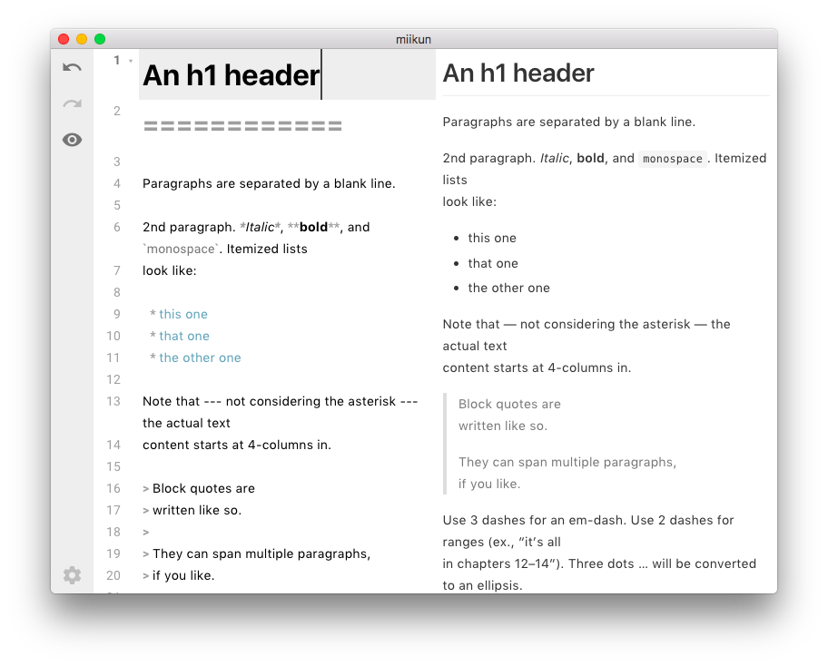

# miikun

> A Simple Markdown Editor



## Build Setup

``` bash
# install dependencies
yarn install

# serve
yarn electron:serve

# build electron app for production
yarn electron:build

# lint all JS/Vue component files in `app/src`
yarn lint

# run webpack in production
npm run pack
```
More information can be found [here](https://simulatedgreg.gitbooks.io/electron-vue/content/docs/npm_scripts.html).

---

This project was generated from [electron-vue](https://github.com/SimulatedGREG/electron-vue) using [vue-cli](https://github.com/vuejs/vue-cli). Documentation about this project can be found [here](https://simulatedgreg.gitbooks.io/electron-vue/content/index.html).
