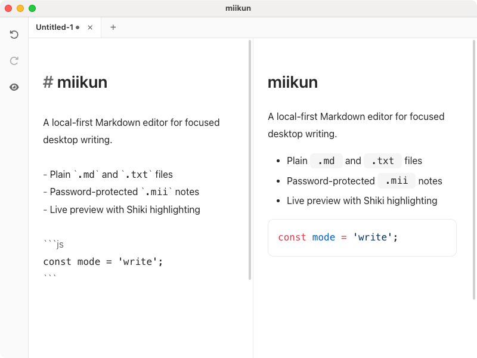

# miikun

> A simple Markdown editor built for focused writing.



miikun is an Electron + React desktop Markdown editor I built because I wanted a simple place to write. It
edits plain `.md` and `.txt` files, saves password-protected `.mii` files, and keeps the UI quiet so the
document stays in front.

Use it when you want local files, native desktop shortcuts, tabs, and preview without a workspace or account.

## Highlights

- Simple local editing for `.md`, `.txt`, and encrypted `.mii` files
- Multi-tab workflow with dirty-state indicators, tab closing, and drag reordering
- Optional live Markdown preview with tables, checkboxes, footnotes, anchors, definition lists, and Shiki
  syntax highlighting
- Password prompt for opening and saving `.mii` files
- Native desktop menus and shortcuts for file, edit, preview, theme, zoom, and window controls
- Light, dark, and system themes, plus an Always on Top mode for reference notes
- Drag-and-drop file opening
- URL paste helper that turns a pasted URL into a Markdown link when the page title can be read

## Quick Start

Prerequisites:

- Node.js
- npm

Install dependencies and launch the Electron app:

```bash
npm install
npm run electron:serve
```

The development server is managed by electron-vite and Vite. Browser-only `npm run serve` / `npm run build`
scripts are not defined because the renderer uses Electron and Node APIs directly.

## Everyday Use

| Action | Shortcut / Path |
| --- | --- |
| New tab | `CmdOrCtrl+T` or `CmdOrCtrl+N` |
| Open file | `CmdOrCtrl+O` or drag a file into the window |
| Save | `CmdOrCtrl+S` |
| Save as | `CmdOrCtrl+Shift+S` |
| Close tab | `CmdOrCtrl+W` |
| Next / previous tab | `Ctrl+Tab` / `Ctrl+Shift+Tab` |
| Toggle preview | `View` -> `Toggle Preview Panel` |
| Change theme | `View` -> `Theme` |
| Always on Top | `CmdOrCtrl+Shift+T` |

To create an encrypted note, save the document with the `.mii` extension and enter a password. Opening that
file later asks for the password before the content is loaded.

## Development

```bash
# Run the Electron app in development
npm run electron:serve

# Build the production desktop app
npm run electron:build

# Build Electron main and renderer output without packaging
npm run prebuild

# Lint JavaScript and React files
npm run lint

# Check SCSS
npm run lint:scss

# Auto-format SCSS
npm run format:scss
```

The current production build configuration targets a macOS zip package.

## Architecture

miikun keeps the Electron main process small and puts the editor workflow in the React renderer. Third-party
libraries are isolated behind adapter modules so the rest of the app depends on app-facing APIs instead of
direct library imports.

Key areas:

- `src/adapters/` wraps CodeMirror, markdown-it/Shiki, filesystem, encryption, and Electron APIs
- `src/services/` owns editor commands, file operations, render sequencing, menus, and tab document state
- `src/components/` contains the editor, tab bar, toolbar, drag-and-drop overlay, and password prompt
- `src/services/` and `src/adapters/` define the boundaries between editor state, file operations, preview rendering, and commands

## Contributing

Issues and focused pull requests are welcome. Before opening a PR, run:

```bash
npm run lint
npm run lint:scss
```

There is no automated test suite yet. For changes that affect behavior, also launch the app with
`npm run electron:serve` and verify the edited workflow manually.

## License

MIT
